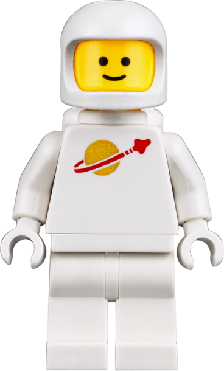
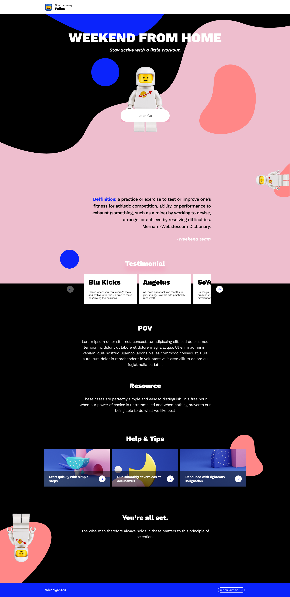
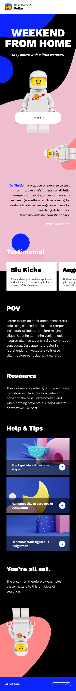

<h1 align="center">
  <br>
  
  <br>
  Weekend From Home
  <br>
</h1>

<h4 align="center">Stay active with a little workout</h4>

<br>

<p align="center">
  <a href="#demo">Demo</a> •
  <a href="#desktop-view">Desktop View</a> •
  <a href="#mobile-view">Mobile View</a> •
  <a href="#how-to-use">How To Use</a> •
  <a href="#credits">Credits</a>
</p>

<br>

## Demo

Here is a working live demo : [https://wknd-by-ardhi.vercel.app/](https://wknd-by-ardhi.vercel.app/)

## Desktop View

<div align='center'>



</div>

## Mobile View

<div align='center'>



</div>

## How To Use

To run this application, you'll need [Node.js](https://nodejs.org/en/download/) (which comes with [npm](http://npmjs.com) or [yarn](https://yarnpkg.com)) installed on your computer. From your command line:

```sh

# Install dependencies
$ yarn install

# Run development mode
$ yarn dev

# Build the app
$ yarn build

# Run production server
$ yarn start

#  set up Next.js' built-in ESLint configuration
$ yarn lint

```

## Credits

This website uses the following open source packages:

- [Axios](https://axios-http.com/)
- [Eslint](https://eslint.org/)
- [Material UI](https://mui.com/)
- [MomentJS](https://momentjs.com/)
- [Node.js](https://nodejs.org/)
- [NextJs](https://nextjs.org/)
- [ReactJs](https://reactjs.org/)
- [Sass](https://sass-lang.com/)
- [SwiperJs](https://swiperjs.com/)
